# Roshan Manirajan ## 1106232001 <h3>Individual Assignment</h3> 
 Through this assignment, I learned how to develop a complete web-based election system using Python Flask, HTML, CSS, Bootstrap, and SQLite. I gained practical experience in designing both the front-end and back-end of a web application, including creating user authentication, managing databases, and implementing CRUD (Create, Read, Update, Delete) operations. I also learned how to connect Flask with a database to store and retrieve election data, implement secure login with password hashing, restrict students to one vote per position, and display live election results using charts and dashboards. Additionally, I improved my understanding of project organization, GitHub version control, and responsive web design. Overall, this assignment enhanced my programming, problem-solving, and software development skills while giving me hands-on experience in building a real-world web application. 
 

<h2>Output 1</h2> 
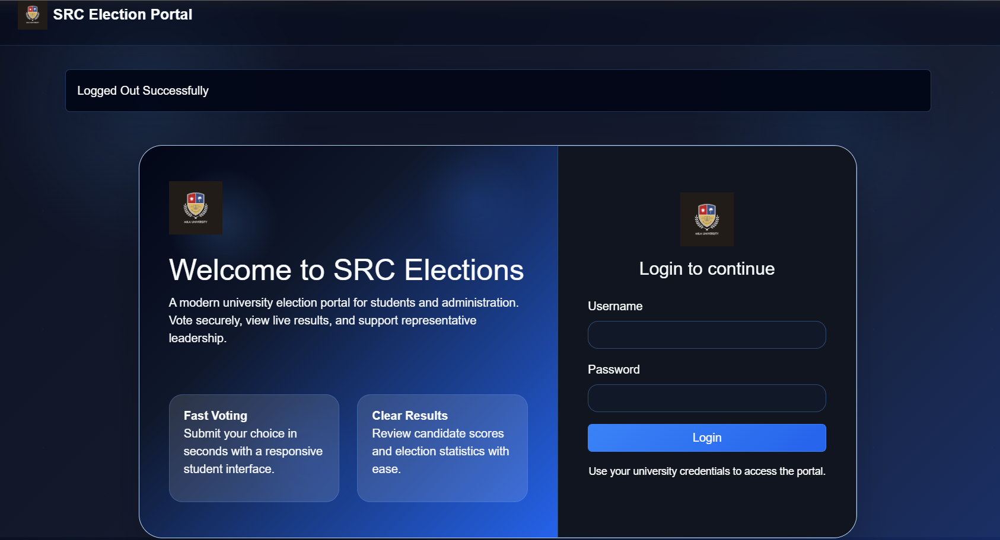
 
This image shows the login page of the election system.
 
 
 <h2>Output 2</h2> 
 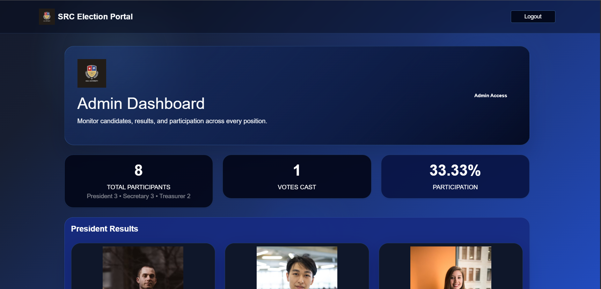
 
This image shows the admin dashboard where the admin can view all positions and voting status.
 
 
 <h2>Output 3</h2> 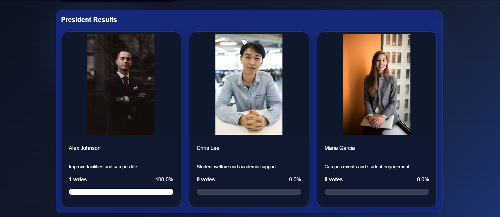 
 
This image shows the election results page displaying the President's vote count and status.

 
  <h2>Output 4</h2> 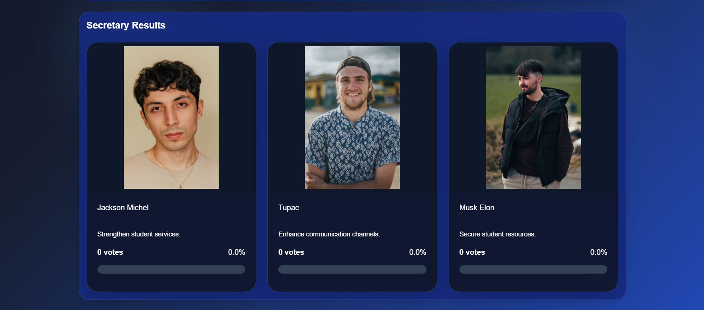 
This image shows the Secretary voting status.

  
   <h2>Output 5</h2> 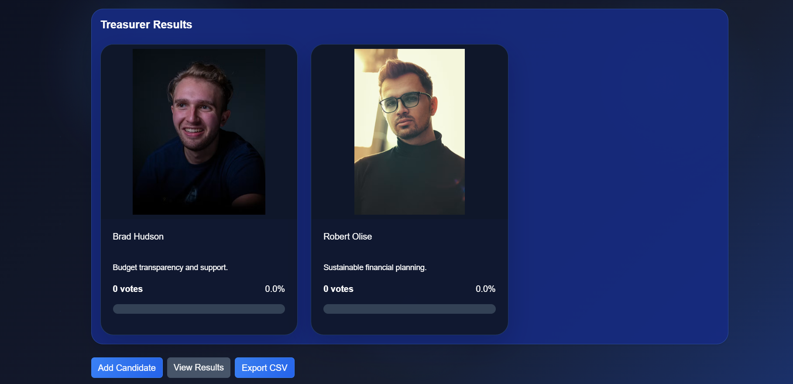 
This image shows the Treasurer voting status.
 
   
   <h2>Output 6</h2> 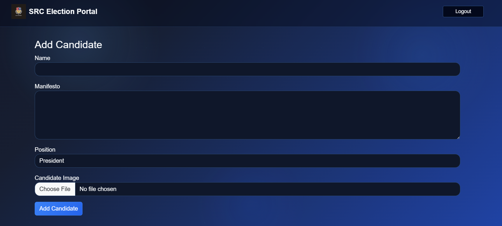 
This image shows the Add Candidate page used by the administrator to add new election candidates.
 
   
   <h2>Output 7</h2> 
   
   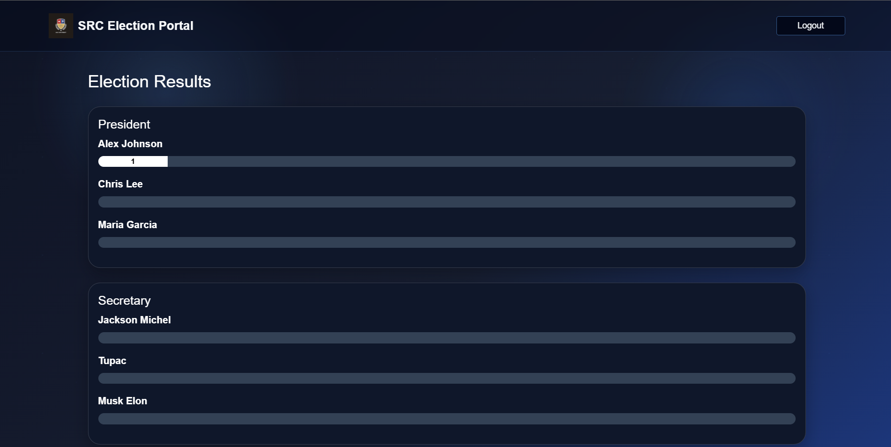 
This image shows the election results page with vote counts and candidate information.
 
   
   <h2>Output 8</h2> 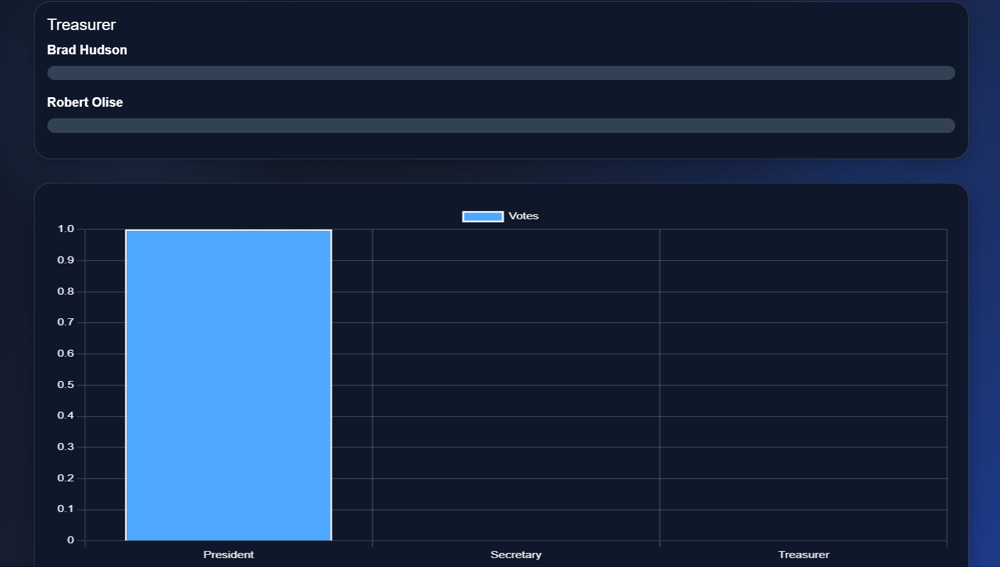 
   
   
This image shows the election results page together with the graphical representation of the voting results.

   
   <h2>Output 9</h2> 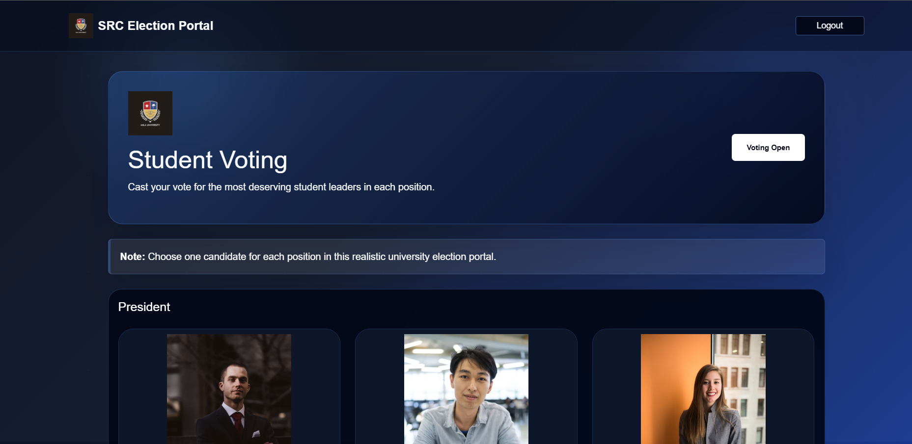 
This image shows the student dashboard where students can view all available positions and cast their votes.

   
   <h2>Output 10</h2> 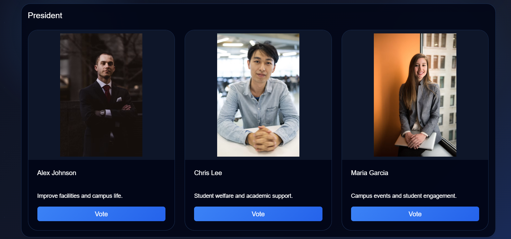 
This image shows the voting page for the President position.

   
   <h2>Output 11</h2> 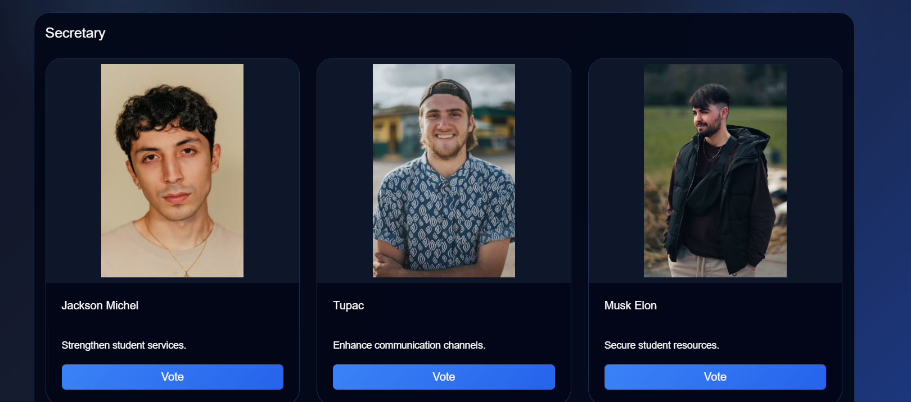 
This image shows the voting page for the Secretary position.
 
   
   <h2>Output 12</h2> 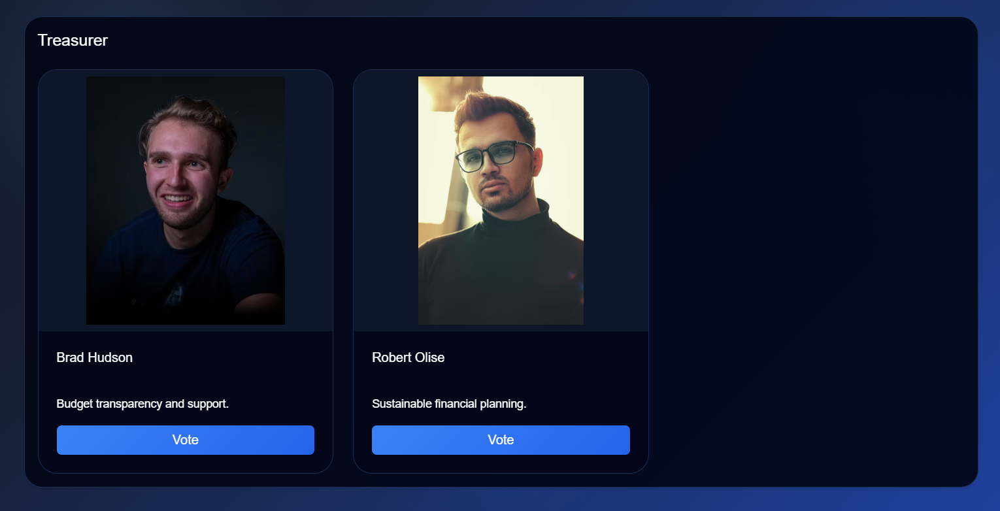 
This image shows the voting page for the Treasurer position.
 
   
   <h2>Output 13</h2> 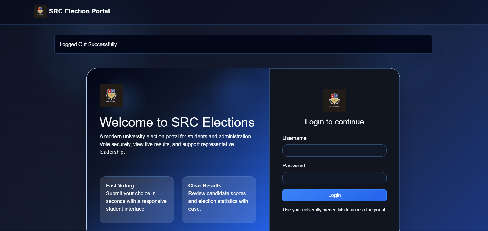 
This image shows the successful logout page displayed after an admin or student logs out of the election system.
